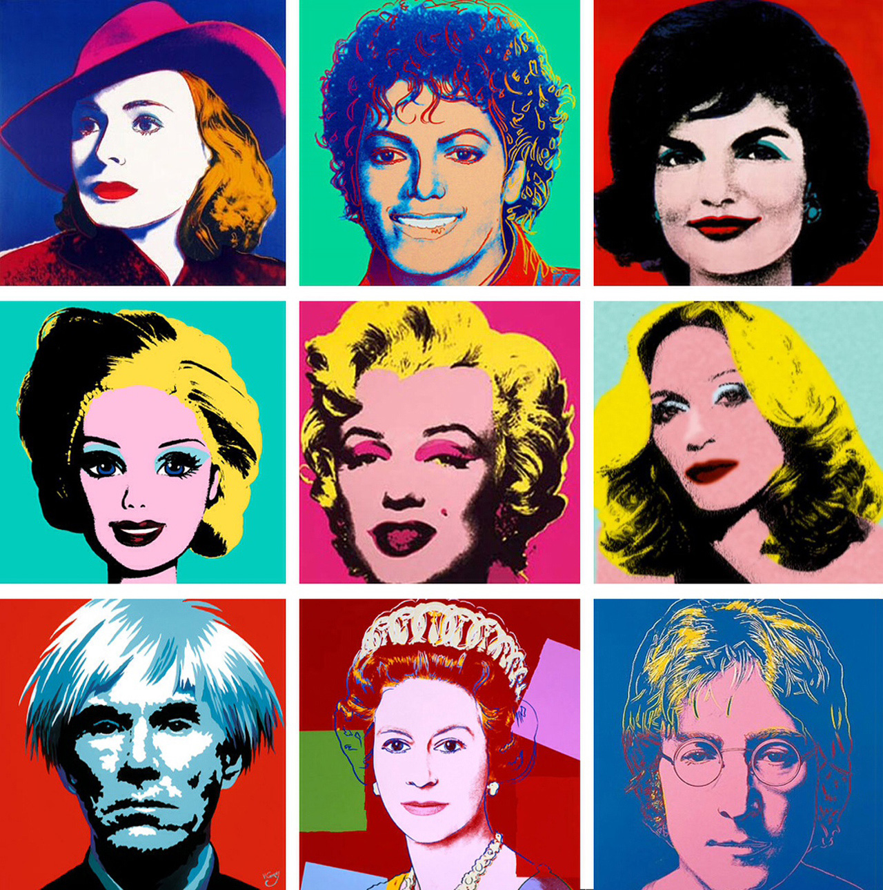

# Warhol Pop Art Image Creator

This repository contains javascript code using the p5 libraries to create a p5 editor through VSCode.
The code ingests one/many image files to map and/or alter the images and reproduce them into an image 
using a pop art style utilized by Andy Warhol.

  
  

The working code has/will have the ability to add different backgraounds to the individual blocks, re-color 
in dividual/multiple blocks, invert colors, and adding borders to separate images.
